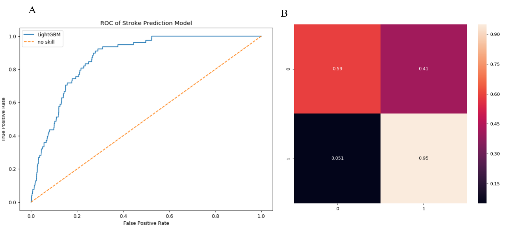

# Factors influencing stroke
### Statistical analysis
The data set is not small but is imbalanced, with only 1.8% of the patients having had a stroke. The dataset also contained non-numerical data. The data also contains NaN values within the 'bmi' and 'smoking_status' columns.

### Predictive model

For tabular data tree based algorithms can outperform neural networks while being faster to run and easier to tune. As this is a short task on a personal computer I decided to use the computationally inexpensive LightGBM for classification. A LightGBM will also ignore missing input values which is useful for this dataset which contains NaNs. 

To convert string features into numerical features suitable for the model I used one-hot encoding. I then removed the “id” feature as it could have no causal relation to stroke, with further causal analysis other features could likely be removed. As “ever_married” and “Residence_type” features were binary I removed one of the one-hot features as each could be fully represented by one column. 

As the dataset is highly imbalanced accuracy can not be used as a good measure of performance. For this application the balance between true positives and false positives is of great importance so I used ROC-AUC as my metric. This choice was also guided by reviewing the kernals relevant to the dataset.

Most of the hyper parameters I used are based on defaults in the documentation and previous experience with reasonable values. To account for the imbalance in the data the positive classes can be scaled within the LightGBM algorithm. I set the scaling to equal the ratio between negative classes and positive classes (54.4), this is the value suggested in the documentation. As the training was running quickly I decreased the learning rate in order to increase the performance.
With the relative rarity of positive stroke data my model was at risk of overfitting. To avoid this I initially removed 10% of the data for a test set. This set was not used in any training of the model nor in threshold selection for the classifier. I also used five-fold cross-validation for testing model performance.

After tuning the hyper parameters the cross validation returned an average ROC-AUC metric of 0.848. I then fully trained the model on 90% of the training data while using 10% as an evaluation set for early stopping. To use the model as a classifier I needed to choose a threshold above which a probability of stroke is classified as positive. I chose this threshold using the ROC of the models predictions using the evaluation set. To achieve a true positive rate of 0.9 the threshold needed to be at most 0.0186.

### Results

***Figure 1: ROC of Stroke prediction model.*** Demonstrates that the model performs (blue, unbroken) better than a no-skill classifier (orange, dashed) at all thresholds outside of the extremes. ROC-AUC metric = 0.867.

The model successfully out-performed a no-skill classifier with a ROC-AUC metric of 0.867 when predicting the test data labels. The model produced a higher true positive rate than false positive rate at all thresholds excluding the extremes (0 and 1). This is demonstrated by Figure 1.

I used the predictions of the model on the test data and the threshold suggested by the evaluation data to classify the test data as stroke or not. Figure 1B shows the confusion matrix. This matrix shows a false positive rate of 41% which is high but also a higher true positive rate than expected, 95%, suggesting the threshold could be lowered.

